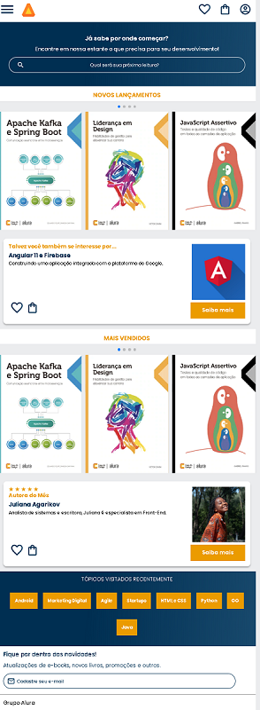

# Página web responsiva para prática HTML & CSS

Projeto construido para praticar HTML e CSS

[🔗 Clique aqui para acessar](https://henriqueapereira.github.io/alurabooks/)

## 🛠️ Tecnologias

- HTML
- CSS
- SwiperJS

📧 ## Contato

- henriqueadrianopereira@gmail.com
- https://www.linkedin.com/in/henriqueadrianop/
